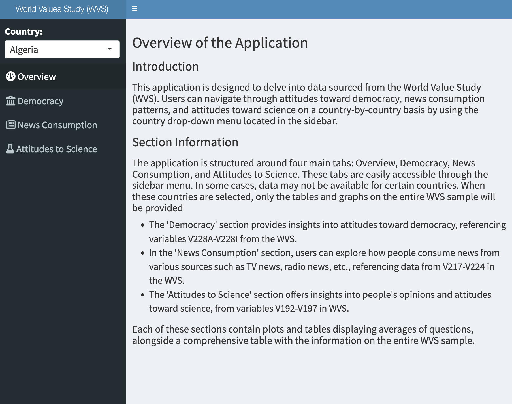
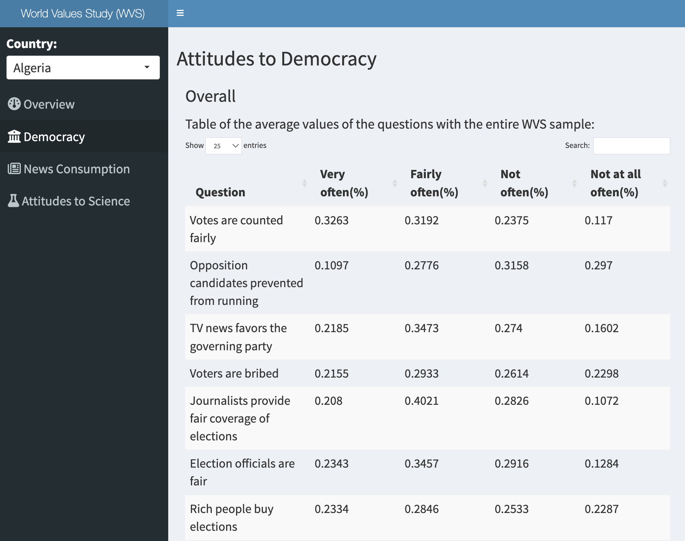

# World Values Study (WVS) Data Application

## Description

The goal of this project is to develop an application that enables users to explore data from the World Value Study (WVS). The application focuses on understanding three aspects: Attitudes to democracy, news consumption, and attitudes to science. The dataset in this project was obtained from [the World Values Survey Association](https://www.worldvaluessurvey.org/WVSDocumentationWV6.jsp). The data was downloaded on 23 April 2024.

The variables that are used in developing this application are as below:

-   Attitudes to democracy: **V228A-V228I**

-   News consumption: **V217-V224**

-   Attitudes to science: **V192-V197**

## Organization of the repo

This repository is organized as follows:

-   **/data** - Contains the [original WVS data set](https://github.com/sungjoocho7/Modern-workflows-in-data-science-Assignment4/blob/f3d77682486f9e5c8c12f4c2f30d8a0a20addf77/data/WV6_Data_R_v20201117.rdata.zip) and [cleaned data set](https://github.com/sungjoocho7/Modern-workflows-in-data-science-Assignment4/blob/f3d77682486f9e5c8c12f4c2f30d8a0a20addf77/data/cleaned_wvs.csv) used in the project.
-   **/script** - Contains a R script for data cleaning and another R script to run the shiny app.
-   **/documentation** - Contains the instructional document.

## Overview of the application

This application is designed to delve into data sourced from the World Value Study (WVS). Users can navigate through attitudes toward democracy, news consumption patterns, and attitudes toward science on a country-by-country basis by using the country drop-down menu located in the sidebar.

The application is structured around four main tabs: Overview, Democracy, News Consumption, and Attitudes to Science. These tabs are easily accessible through the sidebar menu. In some cases, data may not be available for certain countries. When these countries are selected, only the tables and graphs on the entire WVS sample will be provided.

-   The 'Democracy' section provides insights into attitudes toward democracy, referencing variables V228A-V228I from the WVS.

-   In the 'News Consumption' section, users can explore how people consume news from various sources such as TV news, radio news, etc., referencing data from V217-V224 in the WVS.

-   The 'Attitudes to Science' section offers insights into people's opinions and attitudes toward science, from variables V192-V197 in WVS.

Each of these sections contains plots and tables displaying averages of questions, alongside a comprehensive table with the information on the entire WVS sample. Below are screenshots of the application pages.

 *Figure 1*

 *Figure 2*

## URL to the application


## Session info:

```         
R version 4.3.1 (2023-06-16)
Platform: aarch64-apple-darwin20 (64-bit)
Running under: macOS Ventura 13.3

Matrix products: default
BLAS:   /System/Library/Frameworks/Accelerate.framework/Versions/A/Frameworks/vecLib.framework/Versions/A/libBLAS.dylib 
LAPACK: /Library/Frameworks/R.framework/Versions/4.3-arm64/Resources/lib/libRlapack.dylib;  LAPACK version 3.11.0

locale:
[1] en_US.UTF-8/en_US.UTF-8/en_US.UTF-8/C/en_US.UTF-8/en_US.UTF-8

time zone: America/New_York
tzcode source: internal

attached base packages:
[1] stats     graphics  grDevices utils     datasets  methods   base     

other attached packages:
 [1] haven_2.5.3          shinydashboard_0.7.2 plotly_4.10.4        lubridate_1.9.3      forcats_1.0.0        stringr_1.5.0        dplyr_1.1.3         
 [8] purrr_1.0.2          readr_2.1.4          tidyr_1.3.0          tibble_3.2.1         ggplot2_3.4.4        tidyverse_2.0.0      shiny_1.8.0         

loaded via a namespace (and not attached):
 [1] gtable_0.3.4      xfun_0.41         bslib_0.5.1       htmlwidgets_1.6.2 tzdb_0.4.0        crosstalk_1.2.0   vctrs_0.6.4       tools_4.3.1      
 [9] generics_0.1.3    parallel_4.3.1    fansi_1.0.5       pkgconfig_2.0.3   data.table_1.14.8 lifecycle_1.0.3   compiler_4.3.1    munsell_0.5.0    
[17] fontawesome_0.5.2 httpuv_1.6.12     htmltools_0.5.7   sass_0.4.7        yaml_2.3.7        lazyeval_0.2.2    later_1.3.1       pillar_1.9.0     
[25] crayon_1.5.2      jquerylib_0.1.4   ellipsis_0.3.2    rsconnect_1.1.1   cachem_1.0.8      mime_0.12         tidyselect_1.2.1  digest_0.6.33    
[33] stringi_1.7.12    labeling_0.4.3    fastmap_1.1.1     grid_4.3.1        colorspace_2.1-0  cli_3.6.1         magrittr_2.0.3    utf8_1.2.4       
[41] withr_2.5.2       scales_1.2.1      promises_1.2.1    bit64_4.0.5       timechange_0.2.0  rmarkdown_2.25    httr_1.4.7        bit_4.0.5        
[49] hms_1.1.3         memoise_2.0.1     evaluate_0.23     knitr_1.45        viridisLite_0.4.2 rlang_1.1.1       Rcpp_1.0.11       xtable_1.8-4     
[57] glue_1.7.0        rstudioapi_0.15.0 vroom_1.6.4       jsonlite_1.8.7    R6_2.5.1         
```
